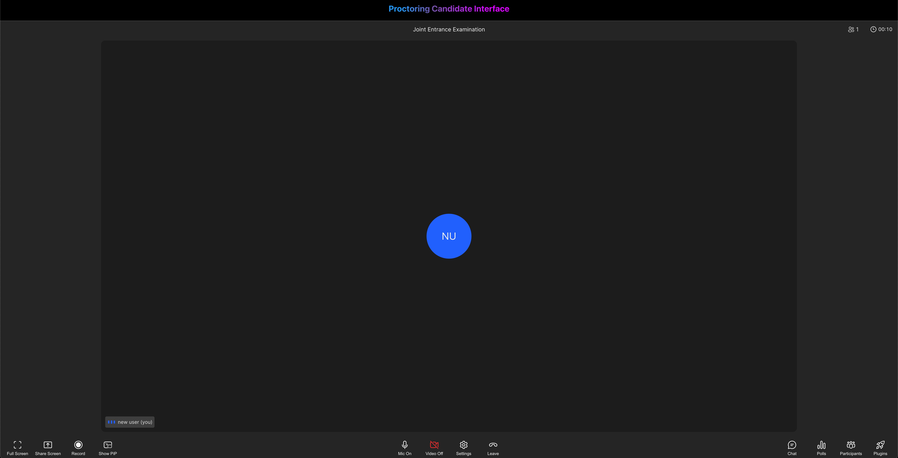

# Building a Live Proctoring System using Dyte (Part - 1)

## TL;DR

By the end of this tutorial, we will have built a "Live Proctoring System" using Dyte APIs that allows the admin to monitor whether there are multiple people peeking into candidate's screen 👀🧑‍💻.

## Introduction

Proctoring is a method of monitoring students during an examination to prevent them from dishonest conduct during exams.

In the case of online exams, it is not possible to have a proctor for each student 🕵️.

This is where live automatic proctoring comes into the picture. It is a method of monitoring students during an online exam using a webcam and a microphone.

It uses computer vision and machine learning to detect if a student is trying to cheat during an online exam.

✨ In this tutorial, we will build a live proctoring system using [Dyte](https://dyte.io/) APIs that allows an admin to monitor if there are multiple people in the video frame of the candidate in real-time and send them a warning message.

## High Level Design of the application

Our aim is to notify the proctor if any other person apart from candidate is seen in the webcam 🔍.

The proctor would be getting the candidate details along with a photograph from the candidate's webcam as a proof right in his meeting sidebar 📸✨.


- In this project, we will be using React with [Dyte UI kit](https://dyte.io/blog/custom-ui-kit-sdk/) and [Dyte React Web Core](https://www.npmjs.com/package/@dytesdk/react-web-core) packages for the frontend.
- For the backend, we will be using [FastApi](https://fastapi.tiangolo.com/lo/) (Python 3).
- We will be also using Database as a service by [ElephantSQL](https://www.elephantsql.com/) (PostgreSQL).
- Lastly we are using [Imgur](https://apidocs.imgur.com/) for storing screenshots. And the image metadata is then saved to the same Database.


## Folder Structure

At the completion of the tutorial, the folder structure would look like this 👇

```
dyting
├── backend
│   ├── app.log
│   ├── app.py
│   ├── imgur.py
│   └── requirements.txt
├── dyte-admin-ss.png
├── dyte-candidate-ss.png
├── frontend
│   ├── README.md
│   ├── package-lock.json
│   ├── package.json
│   ├── src
│   │   ├── App.css
│   │   ├── App.jsx
│   │   ├── App.test.tsx
│   │   ├── Meet.jsx
│   │   ├── Proctor.jsx
│   │   ├── index.css
│   │   ├── index.tsx
│   │   ├── logo.svg
│   │   ├── react-app-env.d.ts
│   │   ├── reportWebVitals.ts
│   │   └── setupTests.ts
│   ├── tsconfig.json
│   └── yarn.lock
└── hld-proc.png
```

## Step 0: Configurations and Setup

🧑‍💻 Before we start building our proctoring system, we would need to set up a Dyte account.

We can create a free account by clicking on "Start Building" on [Dyte.io](https://dyte.io/) and signing up using Google or GitHub 🎉.

Once we have signed up, we can access our [Dyte API keys](https://dev.dyte.io/apikeys) from the "API Keys" tab in the left sidebar. We will keep these keys secure as we will be using later 🔑🤫.

Now, for our proctoring system, we will be using [React](https://react.dev/) for the frontend and [FastAPI](https://fastapi.tiangolo.com/lo/) for building the Backend and APIs.

We will begin by creating a new directory for out project, called `dyte-proctoring` and navigating into it using the following commands:

```bash
mkdir dyte-proctoring
cd dyte-proctoring
```

---

**NOTE**

- We will also require an account of Imgur. Create an account on Imgur and create an API key. Here is a [step-by-step guide](https://apidocs.imgur.com/)
- We will also require an account on ElephantSQL, here is a [step-by-step guide](https://www.elephantsql.com/docs/index.html) to create a db on ElephantSQL.

---

Now back to the tutorial.

## Step 1: Setting up the frontend

We will create a boilerplate React app using `create-react-app`. We can do this by running the following command:

```bash
yarn create react-app frontend --template typescript
```

This will initialize a new React app in the `frontend` directory.

We will install the dyte `react-web-core`, `react-ui-kit` and `react-router` to this project:

```bash
yarn add @dytesdk/react-web-core @dytesdk/react-ui-kit react-router react-router-dom
```

Next, we will add the initial Dyte Meeting component to our app. We can do this by replacing the contents of `frontend/src/App.jsx` with the following code:

```jsx
import { useEffect, useState } from "react";
import Meet from "./Meet";
import Home from "./Home";
import { BrowserRouter, Routes, Route } from "react-router-dom";
import "./App.css";

function App() {
	const [meetingId, setMeetingId] = useState();

	const createMeeting = async () => {
		const res = await fetch("http://localhost:8000/meetings", {
			method: "POST",
			body: JSON.stringify({ title: "Joint Entrance Examination" }),
			headers: { "Content-Type": "application/json" },
		});
		const resJson = await res.json();
		console.log(resJson);
		window.localStorage.setItem("adminId", resJson.admin_id);
		setMeetingId(resJson.data.id);
	};

	useEffect(() => {
		const id = window.location.pathname.split("/")[2];
		if (!!!id) {
			createMeeting();
		}
	}, []);

	return (
		<BrowserRouter>
			<Routes>
				<Route path="/" element={<Home meetingId={meetingId} />}></Route>
				<Route path="/meeting/:meetingId" element={<Meet />}></Route>
			</Routes>
		</BrowserRouter>
	);
}

export default App;
```

This component will create a Dyte meeting link and an `adminId` for the admin. We will store the `adminId` secretly in localstorage. The `adminId` will be used later for accessing any sensitive data.

### **Home component**

Home component renders the `/` route. Create a file as `frontend/src/Home.jsx`.

```jsx
import { Link } from "react-router-dom";
function Home({ meetingId }) {
	return (
		<div
			style={{
				height: "100vh",
				width: "100vw",
				fontSize: "x-large",
				display: "flex",
				justifyContent: "center",
				alignItems: "center",
			}}
		>
			{meetingId && !window.location.pathname.split("/")[2] && (
				<Link to={`/meeting/${meetingId}`}>Create and Join Meeting</Link>
			)}
		</div>
	);
}

export default Home;
```

### **Heading component**

Create a file as `frontend/src/Heading.jsx`.

```jsx
const Heading = ({ text }) => {
    return (
        <div style={{ 
            padding: "10px", 
            textAlign: "center", 
            backgroundColor: "#000", 
            borderBottom: "solid 0.5px gray", 
            height: "3vh" 
        }}>
            <span  className='heading-proctor'>{text}</span>
        </div>
    )
}

export default Heading
```


Now let's delve into the `Meet` component that renders on route `/meeting/:meetingId`.
When the Admin clicks on the link provided on the `/` route, he gets redirected to the meeting page, where we add the user to the meeting as a participant with `group_call_host` preset.

Since, this user created the meeting and was redirected to the meet page, we will assign him `admin` role. Now the link from the address bar can be shared with candidates.

When a candidate opens the shared link, they becomes a regular user. And for every regular user, the component starts emitting screenshots of the users video to our Python server(we'll talk more about it in the next section).

```jsx
import { useState, useEffect, useRef } from 'react';
import { DyteMeeting, provideDyteDesignSystem } from '@dytesdk/react-ui-kit';
import { useDyteClient } from '@dytesdk/react-web-core';
import Proctor from './Proctor';
import Heading from './Heading';
import {SendImageToBackendMiddleware, joinMeeting} from './utils' 
// Constants
let LAST_BACKEND_PING_TIME = 0;
const DETECT_FACES_ENDPOINT = 'http://localhost:8000/detect_faces';
const TIME_BETWEEN_BACKEND_PINGS = 30000;

const Meet = () => {
    const meetingEl = useRef();
    const [meeting, initMeeting] = useDyteClient();
    const [userToken, setUserToken] = useState();
    const [isAdminBool, setAdminBool] = useState(null);
    const meetingId = window.location.pathname.split('/')[2]

    const isAdmin = async (id) => {
        const res = await fetch(`http://localhost:8000/is_admin`, {
            method: "POST",
            body: JSON.stringify({ admin_id: window.localStorage.getItem("adminId"), meeting_id: meetingId }),
            headers: { "Content-Type": "application/json" }
        })
        const resJson = await res.json()
        console.log(resJson)
        setAdminBool(resJson.admin)
    }

    const joinMeetingId = async () => {
        if (meetingId) {
            const authToken = await joinMeeting(meetingId)
            await initMeeting({
                authToken,
            });
            setUserToken(authToken)
        }
    }

    useEffect(() => {
        if (meetingId && !userToken) joinMeetingId()
        isAdmin()
    }, [])

    useEffect(() => {
        if (userToken) {
            provideDyteDesignSystem(meetingEl.current, {
                theme: 'dark'
            });
        }
    }, [userToken])
    
    useEffect(() => {
        if(isAdminBool === false && meeting?.self) {
            console.log(isAdminBool, "isadmin")
            meeting.self.addVideoMiddleware(SendImageToBackendMiddleware);
        }
    }, [isAdminBool])

    return (
        <div style={{ height: "96vh", width: "100vw", display: "flex" }}>
            { userToken && 
                <>
                    {isAdminBool && <div style={{ width: "40vw", height: "100vh", overflowY: "scroll", backgroundColor: "black", borderRight: "solid 0.5px gray" }}><Heading text={"Proctoring Information"} /><Proctor meeting={meeting} /></div>}
                    {isAdminBool ? <div style={{ width: "60vw", height: "96vh" }}><Heading text={"Proctoring Admin Interface"} /><DyteMeeting mode='fill' meeting={meeting} ref={meetingEl} /></div> : <div style={{ width: "100vw", height: "96vh" }}><Heading text={"Proctoring Candidate Interface"} /><DyteMeeting mode='fill' meeting={meeting} ref={meetingEl} /></div>}
                </>
            }
        </div>
    )
}

export default Meet
```

Let's go through some of the functions.
`isAdmin` talks to python server to identify if the current client is Admin or not.
`joinMeeting` adds the current client to the meeting.
`SendImageToBackendMiddleware` sends screenshots of candidates video to the python server.

### **Proctor component**

Proctor component gets activated only for `admins`. Proctor component with the help of `adminId` fetches the suspicious candidates list and render it in chat like format. Create a file `frontend/src/Proctor.jsx

```jsx
import { useEffect, useState } from "react";
import { getCandidateStatus } from "./utils";

const Proctor = () => {
    const [candidateStatuses, updateCandidateStatusState] = useState([])

    const updateCandidateStatus = async () => {
        try {
            const res = await getCandidateStatus()
            updateCandidateStatusState(res)
        } catch(e) {
            setError("User don't have admin privileges.")
        }
    }

    useEffect(() => {
        updateCandidateStatus()
    }, [])

    useEffect(() => {
        if(candidateStatuses?.map) {
            const id = setInterval(() => {
                updateCandidateStatus()
            }, 20000)
            return () => {
                clearInterval(id)
            }
        }
    }, [candidateStatuses])

    return(
        <>
            <div style={{ padding: "0px 20px" }}>
                {candidateStatuses?.map && candidateStatuses ? candidateStatuses.map(status => 
                    <div style={{ display: "flex", justifyContent: "start", margin: "50px 20px" }}>
                        <div style={{ marginRight: "20px"}}>
                            
                        </div>
                        <div style={{ textAlign: "center", padding: "10px", backgroundColor: "#2160fd", fontSize: "x-large", fontWeight: "bold", borderRadius: "10px 10px 10px 10px", width: "50vw",  }} >
                            <div style={{ color: "white", padding: "20px 0px" }}>{status[4]}</div>
                            
                        </div>
                    </div>) : <div style={{ color: "white" }}>Wait or check if you have admin privileges to access the proctoring dashboard.</div>}
            </div>   
        </>
    )
}

export default Proctor;
```

### Utility functions
Let's add or utility functions.

Create a file `frontend/src/utils.js`.
```js
function SendImageToBackendMiddleware() {
    return async (canvas, ctx) => {
        const currentTime = Date.now();            
        if (currentTime - LAST_BACKEND_PING_TIME > TIME_BETWEEN_BACKEND_PINGS) {
            LAST_BACKEND_PING_TIME = currentTime;
            const imgBase64String = canvas.toDataURL('image/png');
            const response = await fetch(DETECT_FACES_ENDPOINT, {
                method: 'POST',
                headers: {
                    'Content-Type': 'application/json',
                },
                body: JSON.stringify({
                    base64_img: imgBase64String,
                    participant_id: meeting?.self.id,
                    participant_name: meeting?.self.name,
                    meeting_id: meetingId
                }),
            });
            const res = await response.json();
            if (res['multiple_detected']) {
                console.log('Warning: Multiple faces detected!');
                sendNotification({
                    id: 'multiple_faces_detected',
                    message: 'Warning: Multiple faces detected!',
                });
            }
        }
    };
}

const joinMeeting = async (id) => {
    const res = await fetch(`http://localhost:8000/meetings/${id}/participants`, {
        method: "POST",
        body: JSON.stringify({ name: "new user", preset_name: "group_call_host", meeting_id: meetingId }),
        headers: { "Content-Type": "application/json" }
    })
    const resJson = await res.json()
    console.log(resJson.detail)
    const data = JSON.parse(resJson.detail)
    return data.data.token;
}

const getCandidateStatus = async () => {
    const response = await fetch("http://localhost:8000/multiple_faces_list", {
        method: 'POST',
        headers: {
            'Content-Type': 'application/json'
        },
        body: JSON.stringify({
            meeting_id: window.location.pathname.split('/')[2],
            admin_id: window.localStorage.getItem("adminId") || "undefined"
        })
    });
    const res = await response.json()
    if(res.details) return undefined
    console.log(res)
    return res
}

export {
    SendImageToBackendMiddleware,
    joinMeeting,
    getCandidateStatus
}
```


To start the React app on the local server, we can run the following command:

```bash
yarn start
```

Now, upon visiting `http://localhost:3000/`, we should be able to see the Dyte meeting in our browser.


## Step 2: Setting up the backend

Now, go back to the root directory of our project and create a new directory called `backend` using the following command:

```bash
cd ..
mkdir backend
cd backend
```

Let create a new file named `Imgur.py` and add the following code, this will help us upload our screenshots to Imgur.

```python
import base64
from fastapi import FastAPI, UploadFile, HTTPException
from httpx import AsyncClient
from dotenv import load_dotenv

load_dotenv()

app = FastAPI()
IMGUR_CLIENT_ID = os.getenv("IMGUR_CLIENT_ID")

async def upload_image(img_data):
    headers = {
        "Authorization": f"Client-ID {IMGUR_CLIENT_ID}"
    }
    data = {
        "image": img_data
    }

    async with AsyncClient() as client:
        response = await client.post("https://api.imgur.com/3/image", headers=headers, data=data)

    if response.status_code != 200:
        raise HTTPException(status_code=500, detail="Could not upload image.")

    print(response.json())
    return response.json()["data"]["link"]
```

Now, we will create a new file named `app.py` and add the following code to it:

```python
import base64
import io
import logging
import random


import uvicorn
from fastapi import FastAPI
from fastapi.middleware.cors import CORSMiddleware
from pydantic import BaseModel
from imgur import upload_image
import face_recognition
import psycopg2

import os
import base64
from fastapi import FastAPI, HTTPException
from pydantic import BaseModel
from dotenv import load_dotenv
from httpx import AsyncClient
import uuid

load_dotenv()

DYTE_API_KEY = os.getenv("DYTE_API_KEY")
DYTE_ORG_ID = os.getenv("DYTE_ORG_ID")

API_HASH = base64.b64encode(f"{DYTE_ORG_ID}:{DYTE_API_KEY}".encode('utf-8')).decode('utf-8')

DYTE_API = AsyncClient(base_url='https://api.cluster.dyte.in/v2', headers={'Authorization': f"Basic {API_HASH}"})

logger = logging.getLogger(__name__)
logging.basicConfig(level=logging.INFO)

fh = logging.FileHandler("app.log")
fh.setLevel(logging.DEBUG)
formatter = logging.Formatter("%(asctime)s - %(name)s - %(levelname)s - %(message)s")
fh.setFormatter(formatter)
logger.addHandler(fh)


class ParticipantScreen(BaseModel):
    base64_img: str
    participant_id: str
    meeting_id: str
    participant_name: str

class ProctorPayload(BaseModel):
    meeting_id: str
    admin_id: str

class AdminProp(BaseModel):
    meeting_id: str
    admin_id: str

class Meeting(BaseModel):
    title: str

class Participant(BaseModel):
    name: str
    preset_name: str
    meeting_id: str

origins = [
    # allow all
    "*",
]

app = FastAPI()

# enable cors
app.add_middleware(
    CORSMiddleware,
    allow_origins=origins,
    allow_credentials=True,
    allow_methods=["*"],  # allow all
    allow_headers=["*"],  # allow all
)

def connect_to_db():
    conn = psycopg2.connect(
            dbname=os.getenv('DB_USER'), 
            user=os.getenv('DB_USER'), 
            password=os.getenv('DB_PASSWORD'),
            host=os.getenv('DB_HOST'),
            port=5432
    )
    return conn

@app.get("/")
async def root():
    return {"message": "Hello World"}

@app.post("/is_admin/")
async def multiple_faces_list(admin: AdminProp):
    conn = connect_to_db()
    cur = conn.cursor()
    cur.execute("SELECT count(1) FROM meeting_host_info WHERE meeting_id = %s AND admin_id = %s", (admin.meeting_id, admin.admin_id,))
    
    count = cur.fetchone()[0]
    
    if(count > 0):
        return { "admin": True }
    else:
        return { "admin": False }

@app.post("/multiple_faces_list/")
async def multiple_faces_list(meeting: ProctorPayload):
    conn = connect_to_db()
    cur = conn.cursor()
    cur.execute("SELECT count(1) FROM meeting_host_info WHERE meeting_id = %s AND admin_id = %s", (meeting.meeting_id, meeting.admin_id,))
    
    count = cur.fetchone()[0]
    
    if(count > 0):
        cur.execute("SELECT * FROM meeting_proc_details WHERE meeting_id = %s ORDER BY ts DESC", (meeting.meeting_id,))
        rows = cur.fetchall()
        conn.commit()
        cur.close()
        conn.close()
        return rows
    else:
        conn.commit()
        cur.close()
        conn.close()
        raise HTTPException(status_code=401, detail="Participant dose not has admin role")

@app.post("/detect_faces/")
async def detect_faces(participant: ParticipantScreen):
    img_data = participant.base64_img.split(",")[1]
    img_data_dc = base64.b64decode(participant.base64_img.split(",")[1])

    file_obj = io.BytesIO(img_data_dc)
    img = face_recognition.load_image_file(file_obj)

    face_locations = face_recognition.face_locations(img)

    if len(face_locations) > 1:
        logger.info(
            f"Detected more than one face for participant {participant.participant_id}"
        )

        upload_resp = await upload_image(img_data)

        conn = connect_to_db()
        cur = conn.cursor()

        cur.execute("CREATE TABLE IF NOT EXISTS meeting_proc_details (ts TIMESTAMP, meeting_id VARCHAR(255), participant_id VARCHAR(255), img_url VARCHAR(255), verdict VARCHAR(255))")

        verdict = f"Detected more than one face for participant \"{participant.participant_name}\" and participant_id {participant.participant_id}"
        cur.execute("INSERT INTO meeting_proc_details (ts, meeting_id, participant_id, img_url, verdict) VALUES (current_timestamp, %s, %s, %s, %s)", (participant.meeting_id, participant.participant_id, upload_resp, verdict))

        conn.commit()
        cur.close()
        conn.close()


        return { "id": participant.participant_id, "multiple_detected": True, "url": upload_resp }

    return {"id": participant.participant_id, "multiple_detected": False}


@app.post("/meetings")
async def create_meeting(meeting: Meeting):
    response = await DYTE_API.post('/meetings', json=meeting.dict())
    if response.status_code >= 300:
        raise HTTPException(status_code=response.status_code, detail=response.text)
    admin_id = ''.join(random.choices('abcdefghijklmnopqrstuvwxyzABCDEFGHIJKLMNOPQRSTUVWXYZ0123456789', k=32))
    resp_json = response.json()
    resp_json['admin_id'] = admin_id
    meeting_id = resp_json['data']['id']

    conn = connect_to_db()
    cur = conn.cursor()
    cur.execute("INSERT INTO meeting_host_info (ts, meeting_id, admin_id) VALUES (CURRENT_TIMESTAMP, %s, %s)", (meeting_id, admin_id))
    conn.commit()
    cur.close()
    conn.close()

    return resp_json


@app.post("/meetings/{meetingId}/participants")
async def add_participant(meetingId: str, participant: Participant):
    client_specific_id = f"react-samples::{participant.name.replace(' ', '-')}-{str(uuid.uuid4())[0:7]}"
    payload = participant.dict()
    payload.update({"client_specific_id": client_specific_id})
    del payload['meeting_id']
    resp = await DYTE_API.post(f'/meetings/{meetingId}/participants', json=payload)
    if resp.status_code > 200:
        raise HTTPException(status_code=resp.status_code, detail=resp.text)
    return resp.text

if __name__ == "__main__":
    uvicorn.run("app:app", host="localhost", port=8000, log_level="debug", reload=True)
```

This code defines a FastAPI application with a single endpoint `/detect_faces` which takes in a base64 encoded image and returns a boolean value indicating if there are more than one faces in the image. It uses the [face_recognition](https://github.com/ageitgey/face_recognition) library to detect faces in the image.

Now, we will create a `.env` and `requirements.txt` file in the `backend` directory and add the following dependencies to it:

`.env`

```txt
DYTE_ORG_ID=<ID>
DYTE_API_KEY=<KEY>
IMGUR_CLIENT_ID=<ID>
DB_USER=<ID>
DB_PASSWORD=<PASSWORD>
DB_HOST=<HOST>
```

`requirements.txt`

```txt
fastapi
uvicorn
face_recognition
numpy
python-multipart
py-dotenv
```

We will now create a virtual environment for our project and install the dependencies using the following commands:

```bash
python -m venv venv
source venv/bin/activate # for linux/mac
venv\Scripts\activate.bat # for windows
pip install -r requirements.txt
```

Now, we can start the backend server using the following command:

```bash
uvicorn app:app --reload --port 8000
```

This Python server helps us create meetings, join meetings, detect multiple faces, get the list of suspicious candidates.

Here, when we hit the `/detect_faces` endpoint with an image file encoded as a base64 string, the `multiple_detected` key of the response would be set to `True` if there are more than one faces in the image, else it would be set to `False`.

We can call this from our frontend with the participant's webcam feed to detect if there are more than one faces in the frame.

## Step 3: Adding the face detection logic to the frontend

Since now we have a nice backend server to detect faces, we can add the face detection logic to our frontend. For this, we will first add some constants to our previously edited `frontend/src/App.tsx` file:

We will be using the above constants in the `SendImageToBackendMiddleware` function which we will add to our `App` component, just after the `useDyteClient` hook.

The `SendImageToBackendMiddleware` is a [Dyte Video](https://dyte.io/blog/streams-blog/) [Middleware](https://docs.dyte.io/web-core/local-user/extras#using-middlewares). Middlewares are add-ons that we can use to add effects and filters to your audio and video streams with ease.

Here, we are using the middleware functionality to get the canvas object of the participant's webcam feed, convert it to a base64 encoded image and send it to our backend server. We are also ensuring that the backend is pinged only once every 30 seconds to avoid unnecessary load on the server.

We then use the `sendNotification` function to [send a notification](https://docs.dyte.io/react-ui-kit/reference#sendnotification) to the participant if the backend returns `True` for the `multiple_detected` key of the response.

The middleware code is as follows:

```tsx
...
    const [meeting, initMeeting] = useDyteClient();

    async function SendImageToBackendMiddleware() {
        return async (canvas: HTMLCanvasElement, ctx: CanvasRenderingContext2D) => {
            const currentTime = Date.now();
            if (currentTime - LAST_BACKEND_PING_TIME > TIME_BETWEEN_BACKEND_PINGS) {
                LAST_BACKEND_PING_TIME = currentTime;
                const imgBase64String = canvas.toDataURL('image/png');
                const response = await fetch(DETECT_FACES_ENDPOINT, {
                    method: 'POST',
                    headers: {
                        'Content-Type': 'application/json',
                    },
                    body: JSON.stringify({
                        base64_img: imgBase64String,
                        participant_id: meeting?.self.id,
                    }),
                });
                const res = await response.json();
                if (res['multiple_detected']) {
                    console.log('Warning: Multiple faces detected!');
                    sendNotification({
                        id: 'multiple_faces_detected',
                        message: 'Warning: Multiple faces detected!',
                    });
                }
            }
        };
    }
...
```

## Step 4: Alerting the participant when multiple faces are detected

That was all the code we needed to add a basic proctoring functionality to our Dyte meeting. The app sends a screenshot of the participant's webcam feed to the backend server every 30 seconds and if the backend detects more than one face in the image, it sends a warning notification to the participant. Additionally, the backend also logs the participant's ID and the time of the detection in the terminal. This can be used to keep track of the participants who may be cheating in the meeting, for later review.

## Step 5: Testing the proctoring system




## Conclusion

Yaay! We have successfully built a proctoring system using Dyte. We can now use this system to proctor our online exams and interviews.

Now that we have built our own proctoring system, we can use it to proctor our online exams and interviews. We can also use this system to build our own online classroom or meeting platform.

The possibilities are endless!
